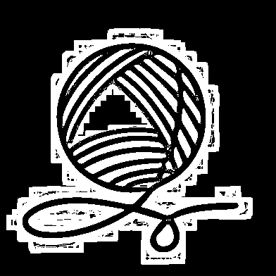
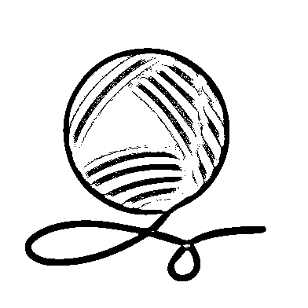
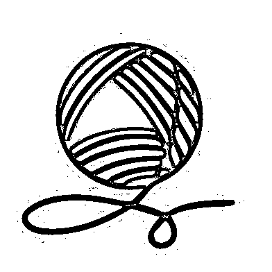

# Отчет об обработке изображения фильтрами

## Исходное изображение

Использовано изображение: `reference.jpg`

---

## Обзор всех фильтров

### 1. Niblack

**Параметры:** window_size=15, k=-0.2

**Описание:** Локальная пороговая обработка методом Niblack

**Анализ изменений:**
Метод Niblack преобразует цветное изображение в бинарное (черно-белое). На исходном изображении с зеленым клубком пряжи на белом фоне метод эффективно выделяет контур клубка и нить. Белый фон становится черным, а зеленые элементы - белыми. Коэффициент k=-0.2 позволяет лучше выделить темные области, что особенно заметно на деталях клубка. Размер окна 15 пикселей обеспечивает локальный анализ, адаптируясь к изменениям яркости в разных частях изображения.

### 2. Sauvola

**Параметры:** window_size=15, k=0.2

**Описание:** Локальная пороговая обработка методом Sauvola

**Анализ изменений:**
Метод Sauvola также создает бинарное изображение, но с более чистыми результатами по сравнению с Niblack. На изображении пряжи метод лучше сохраняет плавные переходы и детали формы клубка. Фон остается более однородным черным, а контуры клубка и нити более четкие и менее шумные. Нормализация через динамический диапазон R=128 делает метод более стабильным на однородных областях, что особенно заметно на белом фоне исходного изображения.

### 3. Adaptive Mean

**Параметры:** window_size=11, c=2

**Описание:** Адаптивная пороговая обработка (Mean)

**Анализ изменений:**
Adaptive Mean создает бинарное изображение с четким разделением между объектом и фоном. На изображении пряжи метод эффективно выделяет зеленый клубок на белом фоне, создавая резкие границы. Использование простого среднего арифметического делает метод быстрым, но может создавать небольшие артефакты на границах, особенно заметные на плавных переходах формы клубка. Константа C=2 слегка смещает порог, улучшая выделение темных областей.

### 4. Adaptive Gaussian

**Параметры:** window_size=11, c=2

**Описание:** Адаптивная пороговая обработка (Gaussian)

**Анализ изменений:**
Adaptive Gaussian использует гауссово взвешивание для более плавных результатов. На изображении пряжи метод создает более естественные границы клубка по сравнению с Mean, с меньшим количеством артефактов. Форма объекта сохраняется лучше, а переходы между черным и белым более плавные. Это особенно заметно на изогнутой нити, где границы выглядят более естественно. Гауссово взвешивание уменьшает влияние краевых пикселей окна, что дает более стабильный результат.

### 5. Добавление

**Параметры:** value=50

**Описание:** Поэлементное сложение (увеличение яркости)

**Анализ изменений:**
Операция добавления увеличивает яркость всех пикселей на 50 единиц. На изображении пряжи белый фон (уже близкий к 255) достигает насыщения и остается белым. Зеленый клубок становится заметно светлее, приобретая более яркий оттенок зеленого. Детали клубка (горизонтальные линии) становятся более различимыми из-за увеличения яркости. Общее впечатление - изображение становится более "воздушным" и светлым, сохраняя при этом все цветовые характеристики исходного изображения.

### 6. Вычитание

**Параметры:** value=50

**Описание:** Поэлементное вычитание (уменьшение яркости)

**Анализ изменений:**
Операция вычитания уменьшает яркость всех пикселей на 50 единиц. На изображении пряжи белый фон становится серым (около 205 вместо 255), создавая эффект затемнения. Зеленый клубок становится темнее, но сохраняет свою форму и цветовые характеристики. Детали клубка остаются видимыми, но с меньшей яркостью. Общий эффект - изображение выглядит более темным и контрастным, как будто освещение уменьшилось. Это полезно для создания эффекта тени или подготовки изображения к дальнейшей обработке.

### 7. Умножение

**Параметры:** value=150 (коэффициент 1.5)

**Описание:** Поэлементное умножение (увеличение яркости)

**Анализ изменений:**
Операция умножения с коэффициентом 1.5 увеличивает яркость пропорционально. На изображении пряжи белый фон быстро достигает максимума (255) и насыщается, оставаясь белым. Зеленый клубок становится ярче пропорционально его исходной яркости - более светлые области зеленого становятся еще светлее, а темные остаются относительно темными. Это создает эффект увеличения контраста: разница между светлыми и темными областями становится более выраженной. Детали клубка становятся более заметными из-за усиления контраста.

### 8. Деление

**Параметры:** value=150 (коэффициент 1.5)

**Описание:** Поэлементное деление (уменьшение яркости)

**Анализ изменений:**
Операция деления с коэффициентом 1.5 уменьшает яркость пропорционально. На изображении пряжи белый фон становится серым (около 170 вместо 255), но остается видимым. Зеленый клубок становится темнее пропорционально - более темные области становятся еще темнее, а светлые уменьшаются, но сохраняют относительные различия. Эффект противоположен умножению: общее затемнение с сохранением пропорций между различными областями изображения. Детали остаются различимыми, но с уменьшенной яркостью.

### 9. Линейное контрастирование

**Параметры:** min_out=0, max_out=255

**Описание:** Линейное растяжение контраста на полный диапазон

**Анализ изменений:**
Линейное контрастирование растягивает гистограмму изображения на полный диапазон [0, 255]. На изображении пряжи метод максимально использует динамический диапазон: минимальные значения (темные области зеленого клубка) отображаются в 0 (черный), а максимальные значения (белый фон) остаются на 255 (белый). Все промежуточные значения линейно масштабируются, что создает максимальный контраст. Зеленый клубок растягивается на весь диапазон оттенков от темно-зеленого до светло-зеленого, что делает детали более заметными. Эффект особенно заметен на горизонтальных линиях клубка, которые становятся более контрастными.

---

## Детальное описание фильтров и их эффектов

### 1. Локальная пороговая обработка

#### Метод Niblack

**Формула:** `T(x,y) = m(x,y) + k × σ(x,y)`

**Почему изображение изменилось:**
- Метод Niblack вычисляет локальный порог для каждого пикселя на основе среднего значения и стандартного отклонения в окрестности
- Коэффициент k = -0.2 означает, что порог немного ниже локального среднего, что помогает выделить темные области
- Результат: бинарное изображение (черно-белое), где белые пиксели соответствуют объектам, а черные - фону
- На изображении с клубком пряжи метод выделяет зеленые элементы на белом фоне, создавая четкий контур

**Особенности:**
- Хорошо работает при неравномерном освещении
- Чувствителен к шуму
- Размер окна 15 пикселей определяет локальную область анализа

#### Метод Sauvola

**Формула:** `T(x,y) = m(x,y) × [1 + k × (σ(x,y)/R - 1)]`

**Почему изображение изменилось:**
- Sauvola - улучшенная версия Niblack, специально разработанная для документов
- Использует нормализацию стандартного отклонения через динамический диапазон R=128
- Коэффициент k = 0.2 контролирует чувствительность к локальным вариациям
- Результат обычно более чистый, с меньшим количеством шума по сравнению с Niblack
- На изображении с пряжей метод создает более плавные переходы и лучше сохраняет детали

**Преимущества перед Niblack:**
- Меньше артефактов на фоне
- Лучше сохраняет тонкие детали
- Более стабильная работа на однородных областях

---

### 2. Адаптивная пороговая обработка

#### Adaptive Mean

**Формула:** `T(x,y) = mean(x,y) - C`

**Почему изображение изменилось:**
- Порог вычисляется как среднее арифметическое значений в локальной области минус константа C=2
- Размер окна 11 пикселей определяет область усреднения
- Метод простой и быстрый, но может быть чувствителен к резким перепадам яркости
- Результат: бинарное изображение с четким разделением на объекты и фон
- На изображении пряжи метод создает четкие границы между зеленым клубком и белым фоном

**Особенности:**
- Быстрое вычисление
- Эффективно для изображений с хорошим контрастом
- Может создавать артефакты на границах

#### Adaptive Gaussian

**Формула:** `T(x,y) = weighted_mean(x,y) - C` (гауссово взвешивание)

**Почему изображение изменилось:**
- Использует гауссово взвешивание вместо простого среднего, что дает больше веса центральным пикселям окна
- Это создает более плавные переходы и уменьшает влияние краевых пикселей
- Результат обычно более гладкий и менее шумный по сравнению с Mean
- На изображении пряжи метод создает более естественные границы и лучше сохраняет форму объекта

**Преимущества перед Mean:**
- Более гладкие результаты
- Меньше артефактов
- Лучше работает на изображениях с градиентами

---

### 3. Поэлементные операции

#### Добавление (Add)

**Формула:** `result(x,y) = image(x,y) + value`

**Почему изображение изменилось:**
- К каждому пикселю добавляется константа 50
- Это увеличивает яркость всего изображения равномерно
- Белый фон становится еще светлее (близок к насыщению на 255)
- Зеленый клубок становится светлее, но сохраняет свой цвет
- Общий эффект: изображение становится более ярким и "воздушным"

**Применение:**
- Коррекция недоэкспонированных изображений
- Осветление темных фотографий
- Улучшение видимости деталей в тенях

#### Вычитание (Subtract)

**Формула:** `result(x,y) = image(x,y) - value`

**Почему изображение изменилось:**
- Из каждого пикселя вычитается константа 50
- Это уменьшает яркость всего изображения
- Белый фон становится серым
- Зеленый клубок становится темнее, но сохраняет форму
- Общий эффект: изображение становится более темным и контрастным

**Применение:**
- Затемнение пересвеченных изображений
- Создание эффекта тени
- Уменьшение яркости для подготовки к дальнейшей обработке

#### Умножение (Multiply)

**Формула:** `result(x,y) = image(x,y) × (value / 100)`

**Почему изображение изменилось:**
- Значение 150 означает коэффициент умножения 1.5
- Каждый пиксель умножается на 1.5, что увеличивает яркость пропорционально
- Светлые области (белый фон) быстро достигают максимума (255) и насыщаются
- Темные области (зеленый клубок) увеличиваются пропорционально
- Эффект: увеличение контраста, светлые области становятся ярче, темные остаются относительно темными

**Особенность:**
- Пропорциональное изменение яркости
- Сохранение относительных различий между областями
- Риск насыщения светлых областей

#### Деление (Divide)

**Формула:** `result(x,y) = image(x,y) / (value / 100)`

**Почему изображение изменилось:**
- Значение 150 означает коэффициент деления 1.5 (деление на 1.5)
- Каждый пиксель делится на 1.5, что уменьшает яркость пропорционально
- Темные области становятся еще темнее
- Светлые области уменьшаются, но остаются видимыми
- Эффект: общее затемнение с сохранением пропорций

**Особенность:**
- Обратный эффект умножению
- Пропорциональное уменьшение яркости
- Сохранение относительных различий

---

### 4. Линейное контрастирование

**Формула:** `out(x,y) = (in(x,y) - min_in) × (max_out - min_out) / (max_in - min_in) + min_out`

**Почему изображение изменилось:**
- Метод растягивает гистограмму изображения на полный диапазон [0, 255]
- Минимальное значение входного изображения отображается в 0 (черный)
- Максимальное значение входного изображения отображается в 255 (белый)
- Все промежуточные значения линейно масштабируются
- На изображении пряжи: белый фон остается белым, зеленый клубок растягивается на весь диапазон оттенков
- Эффект: максимальное использование динамического диапазона, увеличение контраста

**Преимущества:**
- Максимальное улучшение контраста
- Автоматическая нормализация изображения
- Эффективно для изображений с узким диапазоном яркостей

**Особенности:**
- Может усиливать шум
- Требует наличия как темных, так и светлых областей для эффективной работы
- Сохраняет относительные различия между пикселями

---

## Сравнительная таблица фильтров

| Фильтр | Тип результата | Основной эффект | Применение |
|--------|----------------|-----------------|------------|
| Niblack | Бинарное | Локальная бинаризация | Текстовые документы, неравномерное освещение |
| Sauvola | Бинарное | Улучшенная бинаризация | Сканированные документы, текст |
| Adaptive Mean | Бинарное | Простая адаптивная бинаризация | Быстрая обработка, хороший контраст |
| Adaptive Gaussian | Бинарное | Плавная адаптивная бинаризация | Изображения с градиентами |
| Добавление | Цветное | Увеличение яркости | Темные изображения |
| Вычитание | Цветное | Уменьшение яркости | Пересвеченные изображения |
| Умножение | Цветное | Пропорциональное увеличение яркости | Увеличение контраста |
| Деление | Цветное | Пропорциональное уменьшение яркости | Затемнение изображений |
| Линейное контрастирование | Цветное | Максимальное растяжение контраста | Низкоконтрастные изображения |

---

## Выводы

1. **Пороговые методы** (Niblack, Sauvola, Adaptive) преобразуют изображение в бинарное, эффективно выделяя объекты на фоне. Они особенно полезны для подготовки изображений к OCR или выделения контуров.

2. **Поэлементные операции** изменяют яркость изображения, сохраняя цветовую информацию. Они полезны для коррекции экспозиции и общей яркости.

3. **Линейное контрастирование** максимально использует динамический диапазон изображения, улучшая видимость деталей в темных и светлых областях.

4. **Выбор фильтра** зависит от задачи:
   - Для бинаризации документов: Sauvola или Adaptive Gaussian
   - Для улучшения яркости: Добавление или Умножение
   - Для максимального контраста: Линейное контрастирование
   - Для подготовки к дальнейшей обработке: комбинация нескольких фильтров
